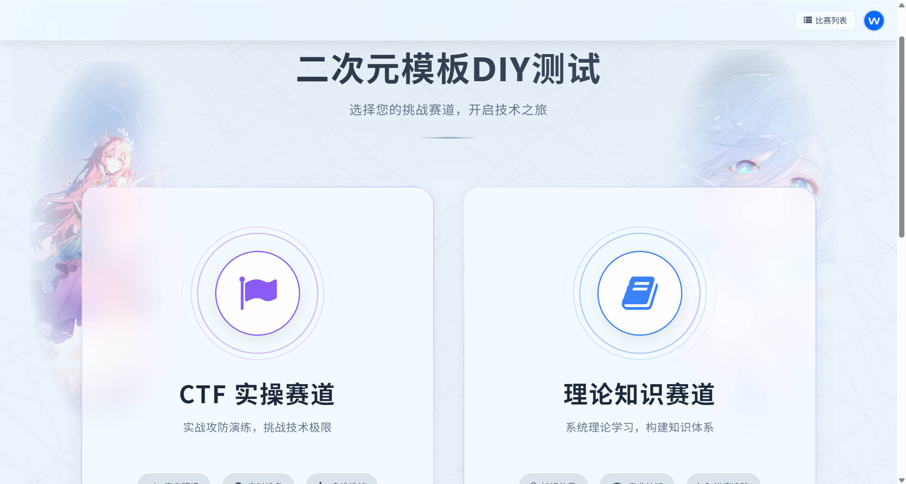
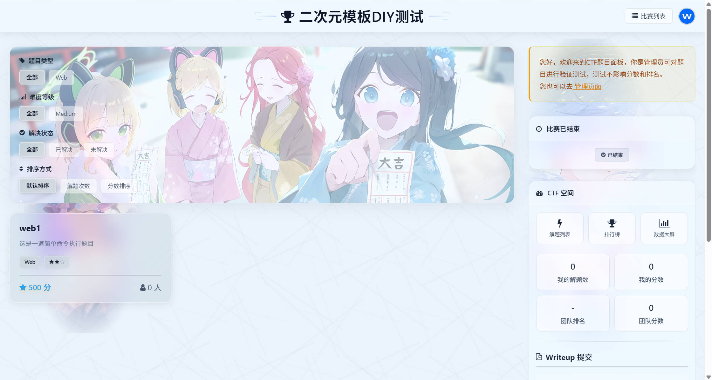
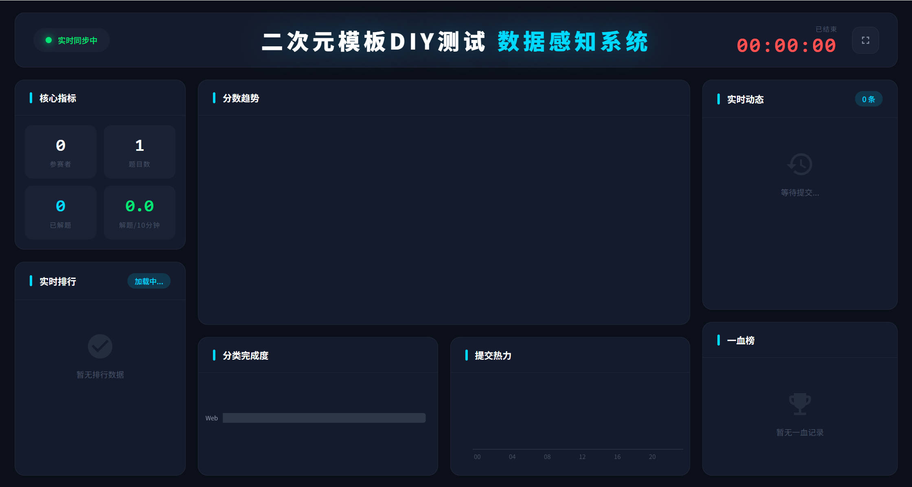
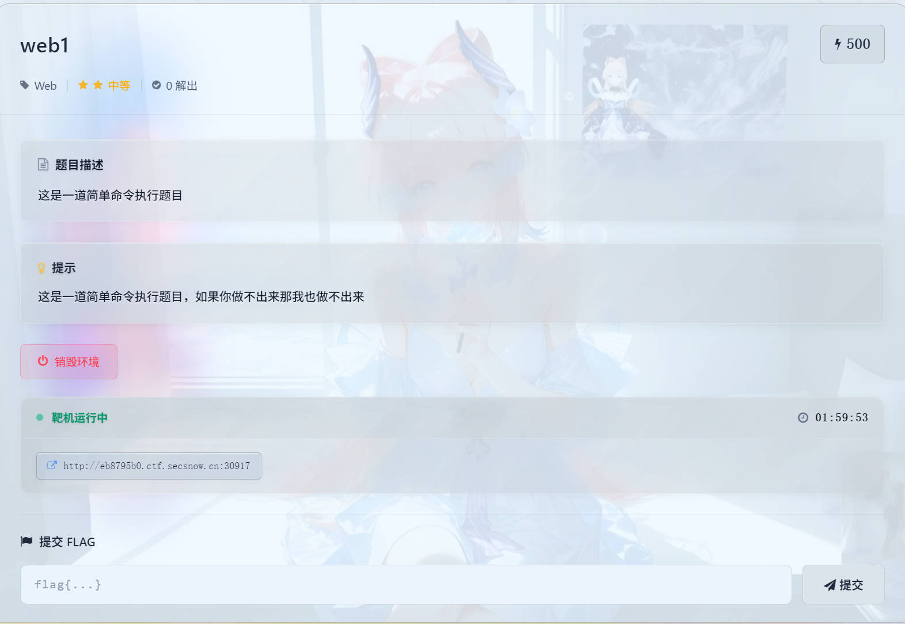

**文档语言 / Document:** [English](README_EN.md) | **简体中文**

# CTF平台-网络安全综合学习系统-个人版（SNOWCTF）（可简称：SCTF）

**一个符合中文使用习惯的网络安全综合学习与竞赛平台**

---

## 系统简介

网络安全综合学习系统是一个专为网络安全教育和竞赛设计的综合性学习平台，整合了 CTF 竞赛、知识竞答、漏洞靶场、知识库管理等核心功能模块，全面覆盖竞赛组织、技能实训、知识沉淀、资源管理与人才培养等多元需求。

**项目目标**：致力于共创、共享高质量的网络安全学习环境

## 核心功能

### 竞赛系统
- **CTF 竞赛平台**：支持个人赛、团队赛，动态分数与FLAG，态势感知大屏，双模板比赛页面（二次元版/科技版），多节点题目服务器隔离、扩容与监控，与知识竞赛联动
- **知识竞赛系统**：理论知识竞答，与 CTF 系统联动，支持单选、多选、判断，填空及简答多种题型，自动化评分，知识竞赛报名模式支持，考试及格线模式支持，可控的答案查阅设置
- **靶场练习系统**：支持会员制练习题目，会员用户可在前台创建题目，学习岛题目分类的练习模式可按照类型学习，全动态Markdown文档支持，评论与交流功能

### 竞赛前端模板

- **二次元版**：二次元版比赛页面
- **科技版**：科技版比赛页面

## 个人版文档与支持

- **文档中心**：[官方文档](https://www.secsnow.cn/wiki/subject/article/this-one/)
- **社区 QQ 群**：517929458

## 网络安全综合学习系统-专业版

专业版面向**企业、高校及商业场景**，在个人版全部功能基础上，采用FASTAPI(性能堪比go——来自官网的介绍)优化和构建，提供更强的并发性能，弥补了个人版再部分场景下的性能不足问题。专业版移除了花里胡哨的功能，保留核心的学习与竞赛能力，并且以此基础扩展了更多需求和功能。

### 个人版 vs 专业版

| | 个人版 | 专业版 |
|--|--------|--------|
| **适用场景** | 个人学习、小型团队、普通校赛与训练 | 企业/高校、商业部署与推广、中大规模竞赛和培训 |
| **性能** | 1x TPS | 5x TPS  |
| **核心功能** | CTF竞赛、漏洞靶场、知识竞赛 | CTF竞赛、漏洞靶场、知识竞赛、攻防竞赛（未正式上线）  |
| **功能差异** | 可选的竞赛模板，非核心功能支持 | 竞赛多FLAG场景、动静态分数与flag、完善的后台管理系统、等级保护与合规、安全审计、访问控制、容器代理与访问限制、AWD\AWDP赛制支持（未上线）、完全融合的理论与实操的竞赛模式、加强版作弊监测和审计  |
| **演示demo** | [www.secsnow.cn](https://www.secsnow.cn/)  | 客户端：[http://111.228.44.199:8282/](http://111.228.44.199:8282/) ，后台：[http://111.228.44.199:8787/](http://111.228.44.199:8787/) ，账号：ctfer，密码：ctf@5678 |

> 专业版部署与合作联系 邮箱 ：**secsnowteam@gmail.com**

## 个人版-二次元版界面预览

#### 赛道选择

#### 比赛列表

#### 数据大屏

#### 题目界面

## 个人版-科技版界面预览

#### 数据大屏

#### 解题动态

#### 题目界面

#### 答题界面

## 公共页面

#### 比赛列表

#### 自动化报名

#### 前台比赛管理

#### 报名信息

#### 创建题目

#### 个人信息页面

---

## 贡献与反馈

欢迎提交 Issue 和 Pull Request！您的支持是我们技术开源的动力！

如有问题或建议，请加入社区 QQ 群：**517929458**

## 致谢

本项目开发过程中使用了部分优秀开源项目的代码与架构，特此感谢：
- [izone](https://github.com/Hopetree/izone) - 博客系统架构参考
- [simpleui](https://github.com/newpanjing/simpleui) - Django 后台 UI 框架

## 许可与声明

### 软件许可协议

详见 [LICENSE](LICENSE) 文件。

### 第三方组件
本项目使用了多个优秀的开源组件，这些组件受其各自的开源许可证保护。
详细的第三方组件列表和许可证信息请查看 [THIRD-PARTY-NOTICES](THIRD-PARTY-NOTICES) 文件。

**重要提示**：
- 使用本软件前，请仔细阅读 LICENSE 和 THIRD-PARTY-NOTICES
- 第三方组件保持其原有许可证不变
- 本开源项目个网络安全综合学习系统个人版，个人版禁止任何形式商业用途。

---

**如果这个项目对你有帮助，请给我们一个 Star！**

Made with ❤️ by 网络安全综合学习系统开发 Team

